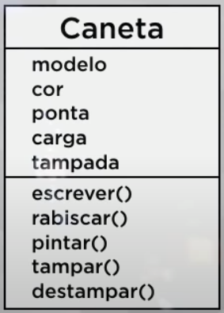
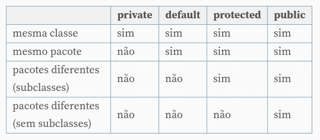

# **Aula 3 — O que é Visibilidade em um Objeto?**

  ## **Linguagem de Modelagem Unificada (UML)**

- Diagrama de Classes:

É feito um quadrado para contextualizar o diagrama de classes. O retângulo é divido em 3 partes: a primeira parte é o cabeçalho que contem o nome da classe, a segunda parte é onde ficam os atributos e a última parte é onde ficam os métodos.

Um exemplo de um diagrama de classes:

## Modificadores de Visibilidade

Indicador de nível de acesso aos componentes internos de uma classe.

- Tipos de modificadores

      público
    
      privado
    
      protegido

- Exemplo: Telefone

      Orelhão é publico (todos podem usar)
    
      Celular é privado (somente o dono)
    
      Telefone fixo é protegido (sua mãe e seus filhos)

- Descrição para a programação

      Público = a classe atual e todas as outras classes podem ter acesso
    
      Privado = somente a classe atual pode ter acesso
    
      Protegido = somente a classe atual e suas sub-classes

    